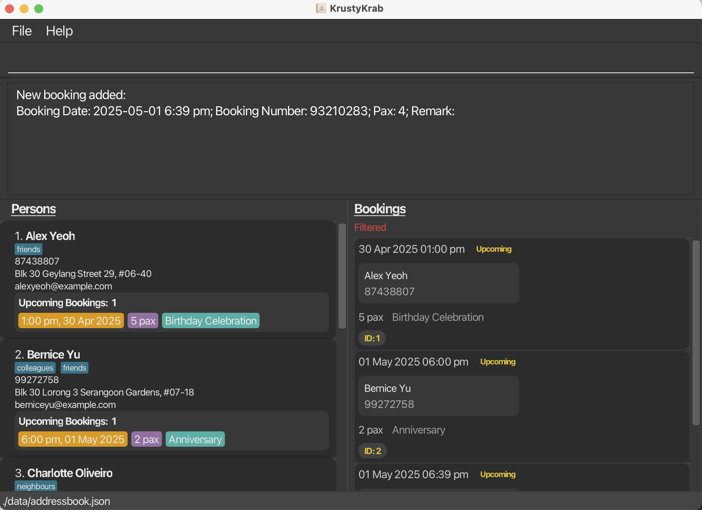

# User Guide

**KrustyKrab** is a lightweight and responsive desktop app for **restaurant staff** to quickly manage customer information and bookings.

KrustyKrab allows you to:

- Keep track of your customers' **contacts, membership status**, and **booking history**.
- Easily view all upcoming bookings at a glance through a **clean list interface**.
- **Add, edit, and cancel** bookings with just a few keystrokes.

KrustyKrab is optimized for use via keyboard commands while still being visually clean and user-friendly.  
If you type fast, you’ll get your booking tasks done quicker than with any mouse-heavy system.

<!-- * Table of Contents -->
<page-nav-print />

--------------------------------------------------------------------------------------------------------------------

## Quick start

1. Ensure you have Java `17` or above installed in your Computer. 
   **Mac users:** Ensure you have the precise JDK version prescribed [here](https://se-education.org/guides/tutorials/javaInstallationMac.html).

1. Download the latest `.jar` file from [here](https://github.com/AY2425S2-CS2103T-T08-2/tp/releases).

1. Copy the file to the folder you want to use as the _home folder_ for your AddressBook.

1. Open a command terminal, `cd` into the folder you put the jar file in, and use the `java -jar addressbook.jar` command to run the application. 
   Example: `cd C:\Users\JasonLim\KrustyHomeFolder\`   
   A GUI similar to the below should appear in a few seconds. Note how the app contains some sample data. 
   

1. Type the command in the command box and press Enter to execute it. e.g. typing **`help`** and pressing Enter will open the help window. 
   Some example commands you can try:

   * `list` : Lists all contacts.

   * `add n/John Doe p/98765432 e/johnd@example.com a/John street, block 123, #01-01` : Adds a contact named `John Doe` to the Address Book.

   * `delete 3` : Deletes the 3rd contact shown in the current list.

   * `exit` : Exits the app.

1. Refer to the [Features](#features) below for details of each command.

--------------------------------------------------------------------------------------------------------------------

## Features

<box type="info" seamless>

**Notes about the command format:** 

* Words in `UPPER_CASE` are the parameters to be supplied by the user. 
  e.g. in `add n/NAME`, `NAME` is a parameter which can be used as `add n/John Doe`.

* Items in square brackets are optional. 
  e.g `n/NAME [t/TAG]` can be used as `n/John Doe t/friend` or as `n/John Doe`.

* Items with `…`​ after them can be used multiple times including zero times. 
  e.g. `[t/TAG]…​` can be used as ` ` (i.e. 0 times), `t/friend`, `t/friend t/family` etc.

* Parameters can be in any order. 
  e.g. if the command specifies `n/NAME p/PHONE_NUMBER`, `p/PHONE_NUMBER n/NAME` is also acceptable.

* Extraneous parameters for commands that do not take in parameters (such as `help`, `plist`, `blist`, and `exit`) will be ignored. 
  e.g. if the command specifies `help 123`, it will be interpreted as `help`.

* If you are using a PDF version of this document, be careful when copying and pasting commands that span multiple lines as space characters surrounding line-breaks may be omitted when copied over to the application.
</box>

### Viewing help : `help`

Shows a message explaning how to access the help page.

Format: `help`

---

### Adding a person: `padd`

Adds a person to the address book.

Format: `padd n/NAME p/PHONE_NUMBER e/EMAIL a/ADDRESS [t/TAG]…​`

<box type="tip" seamless>

**Tip:** A person can have any number of tags (including 0)
</box>

Examples:
* `padd n/John Doe p/98765432 e/johnd@example.com a/John street, block 123, #01-01`
* `padd n/Betsy Crowe t/friend e/betsycrowe@example.com a/Newgate Prison p/1234567 t/criminal`

---

### Adding a booking: `badd`

Adds a booking to the address book.

Format: `badd d/DATE_TIME p/PHONE x/PAX [r/REMARK]`

<box type="tip" seamless>

**Tip:**
- The phone number must belong to an existing person.
- Date and time must be in the format: `yyyy-MM-dd h:mm a`  
  (e.g., `2025-04-03 2:30 PM`)
- You can include an optional remark for the booking.

</box>

Examples:
* `badd d/2025-04-03 2:30 PM p/98765432 x/5 r/Birthday Celebration`
* `badd d/2025-06-10 7:00 PM p/91234567 x/2`

---

### Editing a person: `pedit`

Edits the details of the person identified by the index number in the displayed person list.  
Existing values will be overwritten by the input values.

Format:  
`pedit INDEX [n/NAME] [e/EMAIL] [a/ADDRESS] [m/IS_MEMBER] [t/TAG]…​`

<box type="tip" seamless>

**Tips:**
- `INDEX` refers to the position of the person in the **last shown person list** (must be a positive integer).
- At least one field must be provided.
- You **cannot edit the phone number** of a person.
- `IS_MEMBER` should be `true` or `false`.
- Editing tags will replace all existing tags with the new set. To clear all tags, use `t/` without any value.

</box>

Examples:
* `pedit 1 e/johndoe@example.com`
* `pedit 3 a/123 Sunset Way m/true t/friend t/vip`
* `pedit 2 t/` (clears all tags)

---

### Editing a booking: `bedit`

Edits the details of the booking identified by the booking ID.  
Existing values will be overwritten by the input values.

Format:  
`bedit b/BOOKING_ID [d/DATETIME] [x/PAX] [r/REMARK]`

<box type="tip" seamless>

**Tips:**
- `BOOKING_ID` refers to the ID assigned to the booking (viewable using `blist`).
- Date and time must follow the format: `yyyy-MM-dd h:mm a`  
  (e.g., `2025-04-01 9:00 PM`)
- You must provide at least one field to edit.
- A warning will be shown if you edit the booking to a past date/time.

</box>

Examples:
* `bedit b/1 d/2025-04-01 9:00 PM x/4 r/Anniversary`
* `bedit b/3 r/Changed to private room`
* `bedit b/2 d/2025-05-12 12:00 PM`

---

### Deleting a person : `pdelete`

Deletes the specified person from the address book.

Format: `pdelete INDEX`

* Deletes the person at the specified `INDEX`.
* The index refers to the index number shown in the displayed person list.
* The index **must be a positive integer** 1, 2, 3, …​

Examples:
* `list` followed by `delete 2` deletes the 2nd person in the address book.
* `find Betsy` followed by `delete 1` deletes the 1st person in the results of the `find` command.

---

### Deleting a booking : `bdelete`

Deletes the specified booking from the address book.

Format: `bdelete INDEX`

* Deletes the booking with the specified `INDEX`.
* The index refers to the unique booking ID of the booking.
* The index **must be a positive integer** 1, 2, 3, …​

Examples:
* `bdelete 2` deletes the booking with ID 2.

---

### Marking a booking status: `mark`

Marks a booking with a new status (UPCOMING, COMPLETED, CANCELLED).

Format:  
`mark b/BOOKING_ID s/STATUS`

* The `BOOKING_ID` is shown when you list bookings.
* Status must be exactly one of: `UPCOMING`, `COMPLETED`, `CANCELLED`.

Example:
* `mark b/2 s/COMPLETED`

---

### Finding persons by name: `find`

Finds all persons whose names contain any of the specified **full-word** keywords (case-insensitive), and displays them as a list with index numbers.

Format:  
`find KEYWORD [MORE_KEYWORDS]...`

<box type="tip" seamless>

**Tips:**
- Keyword matching is **case-insensitive** but only matches **whole words**.
- A keyword must match a full word in the person’s name (e.g., `alex` matches "Alex Tan" but not "Alexander").
- You can enter multiple keywords separated by spaces to match more people.

</box>

Examples:
* `find Alice` (matches "Alice Tan", but not "Malice")
* `find alex` (matches "Alex Tan", not "Alexander")
* `find John` returns `john` and `John Doe`
* `find alex david` returns `Alex Yeoh`, `David Li` 
  

---

### Filtering bookings: `filter`

Filters and displays bookings based on phone number, date, status, or any combination.

Format:  
`filter [p/PHONE_NUMBER] [d/DATE] [s/STATUS]`

<box type="tip" seamless>

**Tips:**
- At least one parameter must be provided
- Phone number must match an existing person
- Date must be in the format: `yyyy-MM-dd` (e.g., `2023-12-25`)
- Status must be one of: `UPCOMING`, `COMPLETED`, or `CANCELLED`
- You can combine parameters to filter bookings more precisely

</box>

Examples:
* `filter p/98765432` - Shows all bookings made by the person with phone number 98765432
* `filter d/2023-12-25` - Shows all bookings on 25 December 2023
* `filter s/COMPLETED` - Shows all bookings marked as completed
* `filter p/98765432 d/2023-12-25` - Shows all bookings made by the person with phone 98765432 on 25 December 2023
* `filter p/98765432 s/UPCOMING` - Shows all upcoming bookings for the person with phone 98765432

---

### Listing all persons : `plist`

Shows a list of all persons in the address book.

Format: `plist`

---

### Listing bookings: `blist`

Shows all bookings in the address book.

Format:
* `blist` : Lists upcoming bookings.
* `blist /all` : Lists **all** bookings (including completed/cancelled).

Examples:
* `blist` → Lists only upcoming bookings.
* `blist /all` → Lists all bookings.

---

### Clearing all entries : `clearall`

Clears all person entries and booking entries.
**Warning: This action is irreversible.**

Format: `clearall`

---

### Clearing completed and cancelled bookings: `clearbookings`

Clears all bookings marked as **Completed** or **Cancelled**.

Format:  
`clearbookings`

* Upcoming bookings will **not** be cleared.

Example:
* `clearbookings`

---

### Today's bookings : `today`

Shows all bookings scheduled for today and the related persons who made those bookings.

Format: `today`

* Displays all bookings for the current date.
* Also shows a summary count of upcoming, completed and cancelled bookings for today.
* Shows the list of persons who have bookings today.

Example:
* `today` → Lists all of today's bookings and related persons.

---

### Exiting the program : `exit`

Exits the program.

Format: `exit`

---

### Saving the data

AddressBook data are saved in the hard disk automatically after any command that changes the data. There is no need to save manually.

### Editing the data file

AddressBook data are saved automatically as a JSON file `[JAR file location]/data/addressbook.json`. Advanced users are welcome to update data directly by editing that data file.

<box type="warning" seamless>

**Caution:**
If your changes to the data file makes its format invalid, AddressBook will discard all data and start with an empty data file at the next run.  Hence, it is recommended to take a backup of the file before editing it. 
Furthermore, certain edits can cause the AddressBook to behave in unexpected ways (e.g., if a value entered is outside the acceptable range). Therefore, edit the data file only if you are confident that you can update it correctly.
</box>

### Archiving data files `[coming in v2.0]`

_Details coming soon ..._

--------------------------------------------------------------------------------------------------------------------

## FAQ

**Q**: How do I transfer my data to another Computer? 
**A**: Install the app in the other computer and overwrite the empty data file it creates with the file that contains the data of your previous AddressBook home folder.

--------------------------------------------------------------------------------------------------------------------

## Known issues

1. **When using multiple screens**, if you move the application to a secondary screen, and later switch to using only the primary screen, the GUI will open off-screen. The remedy is to delete the `preferences.json` file created by the application before running the application again.
2. **If you minimize the Help Window** and then run the `help` command (or use the `Help` menu, or the keyboard shortcut `F1`) again, the original Help Window will remain minimized, and no new Help Window will appear. The remedy is to manually restore the minimized Help Window.

--------------------------------------------------------------------------------------------------------------------
## Command summary

Action                | Format, Examples
----------------------|----------------------------------------------------------------------------------------------------------------------------------------------------------------------
**Add Person**        | `padd n/NAME p/PHONE_NUMBER e/EMAIL a/ADDRESS [m/IS_MEMBER] [t/TAG]…​`   e.g., `padd n/James Ho p/22224444 e/jamesho@example.com a/123, Clementi Rd, 1234665 t/friend`
**Add Booking**       | `badd d/DATE_TIME p/PHONE x/PAX [r/REMARK]`   e.g., `badd d/2025-04-03 2:30 PM p/98765432 x/5 r/Birthday Celebration`
**List Persons**      | `plist`
**List Bookings**     | `blist`  `blist /all`
**Edit Person**       | `pedit INDEX [n/NAME] [e/EMAIL] [a/ADDRESS] [m/IS_MEMBER] [t/TAG]…​`   e.g.,`pedit 3 a/123 Sunset Way m/true t/friend t/vip`
**Edit Booking**      | `bedit b/BOOKING_ID [d/DATETIME] [x/PAX] [r/REMARK]`   e.g., `bedit b/1 d/2025-04-01 9:00 PM x/4 r/Anniversary`
**Delete Person**     | `pdelete INDEX`   e.g., `pdelete 3`
**Delete Booking**    | `bdelete INDEX`   e.g., `bdelete 2`
**Find Persons**      | `find KEYWORD [MORE_KEYWORDS]`   e.g., `find James Jake`
**Filter Bookings**   | `filter [p/PHONE_NUMBER] [d/DATE] [s/STATUS]`   e.g., `filter p/98765432`, `filter d/2023-12-25`, `filter s/COMPLETED`
**Mark Booking**      | `mark b/BOOKING_ID s/STATUS`   e.g., `mark b/2 s/COMPLETED`
**Today's Bookings**  | `today`
**Clear All**         | `clearall`
**Clear Bookings**    | `clearbookings`
**Help**              | `help`
**Exit**              | `exit`
